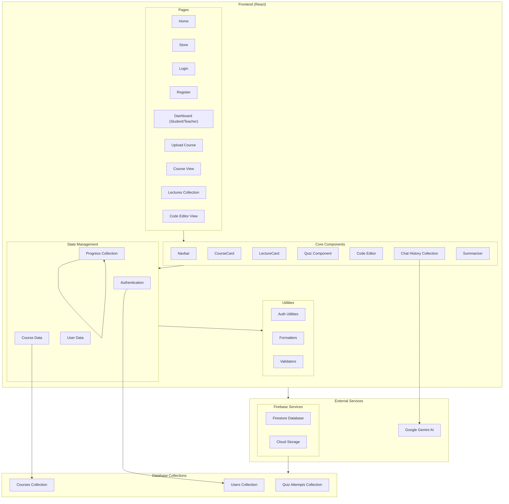
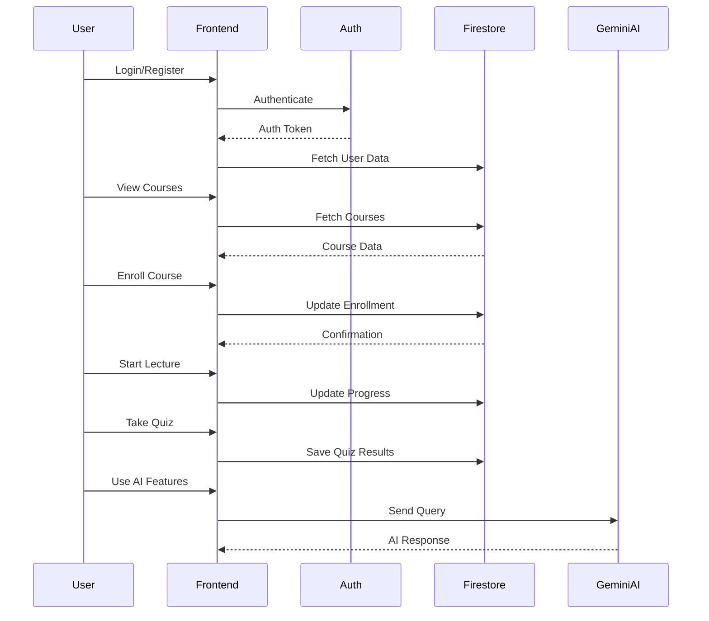
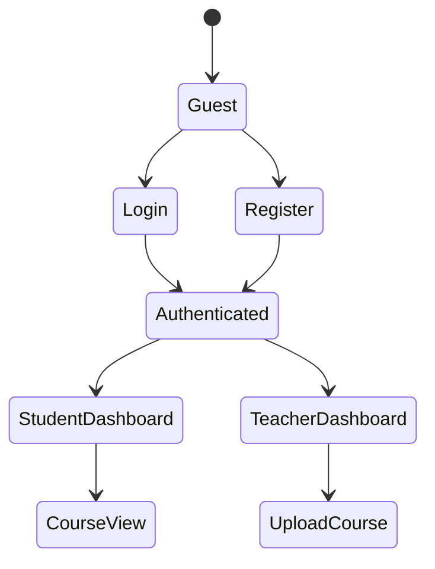

# TISD Frontend Project
# TISD Frontend Architecture

## System Architecture Diagram



## Component Architecture

### Core Components
1. **Navbar**
   - User authentication status
   - Navigation links
   - Theme switcher

2. **CourseCard**
   - Course information display
   - Enrollment handling
   - Progress tracking
   - Teacher controls

3. **LectureCard**
   - Lecture information
   - Progress status
   - Quiz status
   - Video integration

4. **Quiz Component**
   - Question rendering
   - Answer validation
   - Score calculation
   - Progress tracking

5. **Code Editor**
   - Monaco editor integration
   - Code execution
   - Output display
   - Terminal emulation

6. **Chat AI**
   - Gemini AI integration
   - Context management
   - Message history
   - Code formatting

7. **Summarizer**
   - Video content analysis
   - AI-powered summaries
   - Key points extraction
   - Learning path suggestions

## Data Flow Architecture



## Authentication Flow



## File Structure

```
tisd-frontend/
├── src/
│   ├── components/
│   │   ├── Navbar.jsx
│   │   ├── CourseCard.jsx
│   │   ├── LectureCard.jsx
│   │   ├── Quiz.jsx
│   │   ├── CodeEditor.jsx
│   │   ├── Chat.jsx
│   │   └── SummarizerButton.jsx
│   ├── pages/
│   │   ├── Home.jsx
│   │   ├── Store.jsx
│   │   ├── Login.jsx
│   │   ├── Register.jsx
│   │   ├── Dashboard.jsx
│   │   ├── UploadCourse.jsx
│   │   ├── CourseView.jsx
│   │   └── Lectures.jsx
│   ├── utils/
│   │   ├── auth.js
│   │   ├── formatters.js
│   │   └── validators.js
│   ├── firebase/
│   │   └── config.js
│   └── App.jsx
```

## Database Schema

### Users Collection
```javascript
{
  userId: string,
  email: string,
  role: "student" | "teacher",
  name: string,
  enrolledCourses: [{
    courseId: string,
    progress: number,
    enrolledAt: timestamp
  }]
}
```

### Courses Collection
```javascript
{
  courseId: string,
  title: string,
  instructor: string,
  category: string,
  level: string,
  rating: number,
  studentsEnrolled: number,
  lectures: [{
    id: string,
    title: string,
    videoUrl: string,
    hasQuiz: boolean
  }]
}
```

### Quiz Attempts Collection
```javascript
{
  attemptId: string,
  userId: string,
  lectureId: string,
  score: number,
  completedAt: timestamp,
  answers: [{
    questionId: string,
    answer: string,
    isCorrect: boolean
  }]
}
```

## Tech Stack
- React (Frontend Framework)
- Firebase (Backend & Authentication)
- Google Gemini AI (AI Features)
- Monaco Editor (Code Editor)
- TailwindCSS (Styling)
- React Router (Navigation)

## Security & Performance
- Role-based access control
- Client-side form validation
- Lazy loading for components
- Image optimization
- API rate limiting
- Protected routes
- Environment variable management
## Project Structure
```
tisd-frontend/
├── src/               # Source files
│   ├── components/    # Reusable components
│   ├── pages/        # Page components
│   ├── services/     # API services
│   ├── utils/        # Utility functions
│   └── assets/       # Images, fonts, etc.
├── public/           # Static files
└── tests/            # Test files
```

## Getting Started

### Prerequisites
- Node.js (v16 or higher)
- npm or yarn

### Installation
```bash
# Clone the repository
git clone https://github.com/your-username/tisd-frontend.git

# Install dependencies
npm install
# or
yarn install
```

### Running the Application
```bash
# Start development server
npm run dev
# or
yarn dev
```

The application will be available at `http://localhost:3000`

### Running Tests
```bash
npm run test
# or
yarn test
```

## Contributing Guidelines

### Code Style
- Use consistent naming conventions
- Follow ESLint and Prettier configurations
- Write meaningful commit messages
- Document complex logic with comments

### Branch Strategy
1. Create feature branches from `develop`
2. Use format: `feature/feature-name` or `fix/bug-description`
3. Keep commits atomic and focused

### Pull Request Process
1. Ensure all tests pass
2. Update documentation if needed
3. Request review from at least one team member
4. Squash commits before merging

### Code Review Guidelines
- Check for code quality and consistency
- Verify test coverage
- Ensure documentation is updated
- Review for security concerns

## Build and Deployment

### Building for Production
```bash
npm run build
# or
yarn build
```

### Environment Variables
Create a `.env` file in the root directory:
```
REACT_APP_API_URL=your_api_url
```

## Additional Resources
- [Project Wiki](link-to-wiki)
- [API Documentation](link-to-api-docs)
- [Style Guide](link-to-style-guide)
